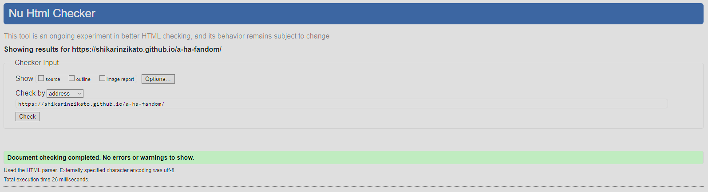
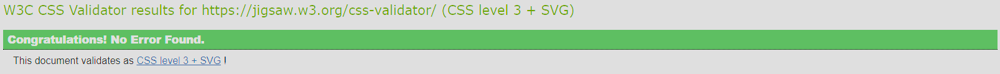
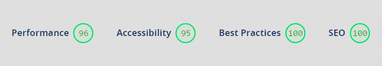

# aha-Fandom

# The purpose with this project

This static website was made to accommodate the needs of a-ha fans around the world, who want a prettier alternative to Wikipedia and other websites dedicated to preserving a-ha`s legacy. The a-ha-Fandom aims to attract more members to enjoy and contribute to making the best a-ha fan-site ever created. The site invites people to become volunteers and help build the a-ha Fandom. The language and layout of the site aims to be friendly, accessible and pretty at the same time.

## Page count and build
a-ha Fandom consists of 6 pages.

### index.html
Contains 16 sections:
header + 14 sections + footer

### about.html
Contains 3 sections:
header + 1 section + footer

### gallery.html
Contains 3 sections:
header + 1 section + footer

### feedback-form.html
Contains 3 sections:
header + 1 section + footer

### thank-you-for-feedback.html
Contains 3 sections:
header + 1 section + footer

### 404.html
Contains 3 sections:
header + 1 section + footer

## Target Audience
The target audience is everyone who is a fan of a-ha and wants to contribute in any way, from reporting inconsistencies, to providing on work that has been done and what needs to be improved.

## Personal Note
This is my first project, although a third or forth or fifth attempt implementing it like a seasoned software dev would. I.e., making regular and concise commits. 

## Requirements
As per requirements i`ve made sure my code has been checked by HTML and CSS validators.

Validators i`ve used:
HTML Validator: https://validator.w3.org/
CSS Validator: https://jigsaw.w3.org/css-validator/

## Live Project Version
A live version of the project can be found here - https://shikarinzikato.github.io/a-ha-fandom/

## UX

### User Demographic

This website is meant for:
 - a-ha fans around the world that want to know more about a-ha. 
 - a-ha fans that want to consider becoming a contributor to a-fa Fandom.
 - Visitors that want to be able to see a-ha related content in a more enjoyable way.
 - Visitors that want to become active contributors.

### User Goals
 - Find information regarding a-ha band, their history, current affairs, future tours, images, videos and so on!

### Requirements

A static responsive website that allows me to demonstrate my learnings so far, which contains some basic functionality combined with high-focus on the use of semantic coding style to enhance accessibility, i.e., use of sections, articles, limiting/reducing the use of non descriptive elements like divs.

The development process has been well documented, by regular and concise commits via GitHub. (Maybe 1 or 2 larger commits..)

Used Languages: HTML, CSS

### Design

This being my first project, I guess I got inspired by Love Running at first but, as I added pages I shifted the design and came up with what I thought was best.

Design is mainly centered on mobile devices and elderly users or people with bad sight.
Nonetheless to show that the site adjusts well to any increase you will see below screenshot featuring different screen sizes, ipad air, surface pro 7, FHD laptops = 1920x1080, HD laptops = 1280x720 and of course galaxy fold. Captured with snipping tool on windows, screensizes viewed with chrome dev tools.

#### Planning

I initially planned a single page website with multiple sections but then decided to challenge myself with adding multiple pages, to improve my ability to track and implement changes across them and style multiple pages as well as large sections, navbars, dropdowns and footers at the same time.
The goal was to create a simple well contrasted website that combines accessibility with design, without sacrificing the other.
I am excited to see how well I fared in that regard, the lighthouse test gave me a 95, so in that regard I am positive.

a-ha Fandom is a 6 page website divided into sections fitting their content appropriately. Some pages like index.html feature the largest sections.

Navbar highlights the current page the user is on.

Dropdown Menu let`s users quickjump to the section they are interested in.

#### Proof of working sections

All other sections are displayed in similar fashion.

#### Colours

Colour palette was what I thought would look good and contrast well between each other. I am happy with how it turned out and lighthouse seems happy  too with a score of 95 for accessibility.

General elements like h1-h4, navbar, dropdown all feature similar colors. (Grey bg, blue font, dark grey when highlighted etc.)

Text elements like p, ol, li, have a white color.

Links are "lightblue", with some exceptions like the a-ha video figcaption.
Figcaptions are "tomato".

#### Typography

Helvetica is the main font.
Arial and sans-serif, are placed to be fallbacks, should Helvetica fail to work.

#### Media

Media has been chosen to limit text induced fatigue aswell as fit the space they are placed in, some sections have images that are from the time period mentioned. Media has been sized and has been given a border radius to make it in my opinion flow better with the design.

## Structure and Feautures 

The a-ha Fandom website is a 6 page website.

### Deconstructing the largest page
#### index.html consists of following section:
 - Header (Logo/Navmenu)
 - Dropdown
 - Band-Introduction-and-History
 - Hunting High and Low (1984 - 1986)
 - Golden Age (1986-1994)
 - First Comeback (1994 - 2007)
 - New Direction and Farewell (2008 - 2010)
 - Post a-ha Activities and Second Comeback 
 - MTV Unplugged and Hunting High and Low Tours
 - Return After COVID-19 Pandemic and True North (2022-Present)
 - Their Legacy
 - Awards and Band Members
 - Band Members (3 articles, each member has their own article)
 - Discography and World Tours
 - World Tours (ordered List)
 - Footer (Use of Address to further improve on accessibility)

 In order to make navigation easier between the pages a navbar is placed at the top of the screen, also the active nav page has a bottom border indicating which page the user is on.

 For quick navigation to a preferred section the dropdown button is placed below the navbar.

 Each image is wrapped inside a fig with a figcaption. (Figure on Line: 68-71 has no caption since intro text is right below it... avoiding redundancy)

### Existing Features

#### Header and Navigation Section

  - Text based Logo centered horizontally with slight margins and padding which allows font-calc to be properly executed and makes the less likely to overlap.
  - Menu items are anchored to pages on the same website.
  

#### Dropdown button and content

  - Dropdown items are anchored to content on the same page, self adjusting to size for screen size increase.
    screen-size reduction below 363px is handled by a media-query.
  - Dropdown content drops right below the button, finetuned by padding in css.
    

#### Feedback-form

  - The purpose of this section is to make feedback as easy as possible. The feedback can be given completely anonymously, feedback categories are in place to help sort feedback. The User can use the form to give feedback, text-area for feedback has a required attribute to limit potential spam. 
  If the form is used in this version it sends the User to a form-dump page with a message.
  
  

#### Footer Section

  - The Footer contains contact info like links to the e-mail address that either takes you to your default e-mail app or can be manually copied and pasted, the feedback form takes the user to feedback-form.html
  

#### Form-dump page

  - This site contains a thank-you-for-feedback.html with a thank you message when the form has been used and everything executed correctly.
  - The purpose of this page is to give the user an indication on that the form is working and that the message has been recived.
    

### 404.html
  - 404.html has been added as a proof of concept as per Mentor advice, no logic is in place for it.
    

### Features Left to Implement

- Make nav and dropdown stick to the top of the page or add a small separate button that takes the user back to the top of the page to save precious screen area, since the font-size a
- Figure out make the dropdown button, only appear when the button itself is hovered. I coded and moved on too fast from the dropdown button in other words, i`ve coded   myself into a corner on this one, will figure it out and comeback to fix the issue later on!
- Increase social media presence! a-ha fandom has no social media accounts yet. (Didn`t want to make fake accounts)

[Back to top](#nacka-tomato-society)

## Technologies used

- [HTML](https://en.wikipedia.org/wiki/HTML)
- [CSS](https://en.wikipedia.org/wiki/CSS)

## Testing 

Test of functionality and appearance of the website has been dealt with through out all stages of the development.

Test has been conducted using Google Chrome, Opera GX. Testing different devices and screen resolutions has been conducted using Google Chrome DevTools.

Listed are issues, that either still need a fix or have been solved.

1. Font-size calc adjusted to make font even more readably, heavy focus on older people, for ease of readability.
 - Solution: increased and in some cases reduced em to vw ratio for font-size calc (Nav, Dropdown, p, figcaptions, footer, etc all have different font-size calc to maintain some design flow)
2. Some Images appeared pixelated when stretched across different screen sizes
 - Solution: Max-width attribute instead of vw solved the problem.
3. Poor performance on screens with a width smaller than 363px.
 - Solution: Solved this by using media queries and now the elements like navbar fit into their boxes without overflowing and disrupting the intended design and are now shown appropriately.

Apart from standard code issues there have been a lot of minor issues. The majority of these has been due to sections and articles missing headings, misuse of alt attributes for non-image elements, this I also fixed via use of ARIA-Labels like (aria-label, aria-labelledby).

### Validator Testing 

- HTML
- No errors returned when passing through the official [W3C Validator](https://validator.w3.org/nu/?doc=https%3A%2F%2Fshikarinzikato.github.io%2Fa-ha-fandom%2F)

- CSS
- No errors returned when passing through the official [(Jigsaw validator)](https://jigsaw.w3.org/css-validator/validator?uri=https%3A%2F%2Fshikarinzikato.github.io%2Fa-ha-fandom%2Findex.html&profile=css3svg&usermedium=all&warning=1&vextwarning=&lang=en)

- Lighthouse testing
- Lighthouse returned very good scores [Lighthouse Report](https://www.webpagetest.org/result/240307_BiDcZ8_GEK/)

## Development and Deployment

The development environment used for this project was GitPod. To track the development stage and handle version control regular commits and pushes to GitHub has been conducted. The GitPod environment was created using a template provided by Code Institute.

The site was deployed to GitHub pages. The steps to deploy are as follows:

    In the GitHub repository, navigate to the Settings tab
    From the source section drop-down menu, select the Master Branch
    Once the master branch has been selected, the page will be automatically refreshed with a detailed ribbon display to indicate the successful deployment.

Live Server Extension was also used to smoothen the development.

The live version of the project is deployed at GitHub pages.
The live link can be found here - https://shikarinzikato.github.io/a-ha-fandom/index.html

## Content 

- All text content on this site has been produced by the author of the project and is based on real events by data found on wikipedia. 
- The design of the project is inspired a project of spontaneous decisions and completely unplanned. Some code has been borrowed from Bro Code to assist with styling inputs for the feedback-form.
Line: 282 - 284 in style.css
- The icon displayed in the browser tab is taken from 
[Icon Kitchen](https://icon.kitchen/i/H4sIAAAAAAAAAz1OywrCMBD8l%2FVaoXgRcvUHBHsTD5tm88C0W5PUB6X%2FbhKxLCwzw%2BzMLvBEP1MEsYDCcO8sDQRCo4%2FUgDTdZ8oUevYcoAH9FxK9048XIAD3FjOX5lSdAnZH2aM%2BVM8ZlXKjKR2JJxBtA8EZm%2B8ykpwSDxV60kVbS87FYi2KjxkD1Zgtuu3LQPYNrGZfvr8CjiqwU9npOOb9Igm39QvzJ%2Bz14AAAAA%3D%3D)

## Media

- All images are downloaded from Wikipedia and Google with creative commons license filter enabled, this allows usage for public purposes.
  [Link to images found on wikipedia](https://en.wikipedia.org/wiki/A-ha)
- [Link for creative commons license on google](https://elements.envato.com/license-terms)

  

## Credits 

### For code inspiration, design inputs, help and advice. Many thanks to:

Martina Terlevic (Mentor)
 - Fantastic Coach and Mentor, guided me without giving me easy solutions, encouraging me to solve instead of relying on the easy way out! Huge Thanks to her for treating me like a real junior dev!

Lewis (Tutor Support)
- Helped me find out why I haven`t seen changes in my style.css file after editing and trying everything I can to fix the issue for 3 hours, just to find to find out I have worked on a 2nd copy of the style.css that I accidentally created. Damn these fingers of mine... and thanks to Lewis who helped me find the problem.

### Great sources

Ressources that saved my mental health by teaching or explaining things I didn`t understand. Damn YOU Flexbox!!!

#### W3Schools
https://www.w3schools.com/
#### Stack Overflow
https://stackoverflow.com
#### freeCodeCamp
https://freecodecamp.org
#### CodeCademy
https://www.codecademy.com/
#### Bro Code, helped me, a fellow bro understand many concepts like flexbox better, thanks Bro!
https://www.youtube.com/watch?v=HGTJBPNC-Gw&list=PLqZamzGcYQ24EnnCKEe7c415zFUMTlfE0&index=9&t=13099s

And all the content in HTML-Essentials, CSS-Essentials and the Walkthrough project ”Love Running” that has provided essential knowledge.

The screenshot showcasing responsive design was made by:
https://ui.dev/amiresponsive?url=https://shikarinzikato.github.io/a-ha-fandom/

Best Wishes from me, mi Amigos!