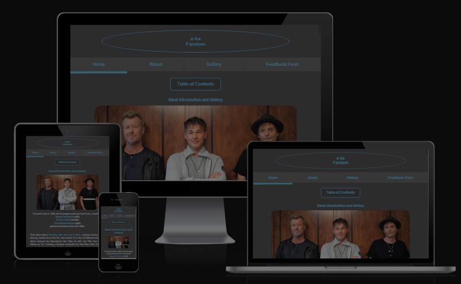

# a-Fandom

# The purpose with this project

This static website was made to accommodate the needs of a-ha fans around the world, who want a prettier alternative to Wikipedia and other websites dedicated to preserving a-ha`s legacy. The a-ha-Fandom aims to attract more members to enjoy and contribute to making the best a-ha fan-site ever created. The site invites people to become volunteers and help build the a-ha Fandom. The language and layout of the site aims to be friendly, accessible and pretty at the same time.

##The site consists of 6 pages.

### Page count and build
a-ha Fandom consists of 6 pages.

#### index.html
Contains 16 sections:
header + 14 sections + footer

#### about.html
Contains 3 sections:
header + 1 section + footer

#### gallery.html
Contains 3 sections:
header + 1 section + footer

#### feedback-form.html
Contains 3 sections:
header + 1 section + footer

#### thank-you-for-feedback.html
Contains 3 sections:
header + 1 section + footer

### error-404.html
Contains 3 sections:
header + 1 section + footer

## Target Audience
The target audience is everyone who is a fan of a-ha and wants to contribute in any way, from reporting inconsistencies, to providing on work that has been done and what needs to be improved.

## Personal Note
This is my first project, although a third or forth or fifth attempt implementing it like a seasoned software dev would. 

## Requirements
As per requirements i`ve made sure my code has been checked by HTML and CSS validators.

Validators i`ve used:
HTML Validator: https://validator.w3.org/
CSS Validator: https://jigsaw.w3.org/css-validator/

## Live Project Version
A live version of the project can be found here - https://shikarinzikato.github.io/a-ha-Fandom/

# Table of Content

+ [UX](#ux "UX")
  + [User Demographic](#user-demographic "User Demographic")
  + [User Stories](#user-stories "User Stories")
    + [Existing Members](#existing-members "Existing Members")
    + [New Users](#new-users "New Users")
  + [User Goals](#user-goals "User Goals")
  + [Requirements](#requirements "Requirements")
  + [Design](#design "Design")
    + [Colours](#colours "Colours")
    + [Typography](#typography "Typography")
    + [Images](#images "Images")
+ [Features](#features "Features")
  + [Existing Features](#existing-features "Existing Features")
    + [Header and Navigation Section](#header-and-navigation-section "Header and Navigation Section")
    + [Hero Header Section](#hero-header-section "Hero Header Section")
    + [About us Section](#about-us-section "About us Section")
    + [2022 Events Section](#2022-events-section "2022 Events Section")
    + [Contact and Registration Section](#contact-and-registration-section "Contact and Registration Section")
    + [Footer Section](#footer-section "Footer Section")
    + [Form-dump page](#form-dump-page "Form-dump page")
  + [Features Left to Implement](#features-left-to-implement "Features Left to Implement")
+ [Technologies used](#technologies-used "Technologies used")
+ [Testing](#testing "Testing")
  + [Validator Testing](#validator-testing "Validator Testing")
  + [Unfixed Bugs](#unfixed-bugs "Unfixed Bugs")
+ [Development and Deployment](#development-and-deployment "Development and Deployment")
+ [Content](#content "Content")
+ [Media](#media "Media")
+ [Credits](#credits "Credits")

## UX

### User Demographic

This website is meant for:
 - a-ha fans around the world that want to know more about a-ha. 
 - a-ha fans that want to consider becoming a contributor to a-fa Fandom.
 - Visitors that want to be able to see a-ha related content in a more enjoyable way.
 - Visitors that want to become active contributors.

### User Goals
 - Find information regarding a-ha

### Requirements

A static responsive website that allows me to demonstrate my learnings so far, which contains some basic functionality combined with semantic code.
The development process has been well documented, by regular and concise commits via GitHub.

Used Languages: HTML, CSS

### Design

This being my first project, I guess I got inspired by designs I have seen through out the years, I couldn`t name any with a gun pointed at me.
I guess the design is something that seemed intuitive for me and what came about throughout the development stage.

I initially planned a single page website with multiple sections but then decided to challenge myself with adding multiple pages, to improve my ability to track and implement changes across them and style multiple pages as well as large sections, navbars, dropdowns and footers at the same time.

The goal was to create a simple well contrasted website that combines accessibility with design, without sacrificing the other. I am excited to see how well I fared in that regard, the lighthouse test gave me a 95, so in that regard I am positive.

a-ha Fandom is a 6 page website divided into sections fitting their content appropriately. Some pages like index.html feature the largest sections.

Navbar highlights the current page the user is on and Dropdown Menu let`s users quickjump to the section they are interested in.

#### Colours

Colour palette was what I thought would look good and contrast well between each other. I am happy with how it turned out and lighthouse seems happy  too with a score of 95 for accessibility.

#### Typography

Helvetica is the main font.
Arial and sans-serif, are placed to be fallbacks, should Helvetica fail to work.

#### Media

Media has been chosen to limit text induced fatigue aswell as fit the space they are placed in, some sections have images that are from the time period mentioned. Media has been sized and has been given a border radius to make it in my opinion flow better with the design.

[Back to top](#a-ha-fandom)

## Features 

The Nacka Tomato Society website is a single page website that consists of these sections:

 - Header (Logo/Menu)
 - Hero Header
 - About Us
 - 2022 Events
 - Contact and Registration
 - Footer

In order to make navigation easier between the sections the navigation bar is fixed on top when the user scrolls thru the page.

### Existing Features

#### Header and Navigation Section

  - The Header consists of a Logo section, text-based, that is aligned to the right and a Menu that is aligned to the left.
  - The Header is at a fixed position on top and follows the user as the user scrolls down the page. Menu items are anchored to sections on the website.

#### Hero Header Section

  - The Hero Header section contains a Hero Image, header and a paragraph.
  - The section will give user a sense of home grown tomatoes and comfort. The section also contains a header and a paragraph that gives the user a clear message on what this website is about.

#### About us Section

  - The about us sections is divided in two parts. One informative part with a longer paragraph next to an image with the founder. The second part consists of three images each with a short paragraph on the bottom.
  - The purpose of the About Us section is to give Users a feel of what NTS is and why it was founded. It also gives the User an idea on what happens on events and gatherings. The images gives a comforting feel.

About Us - Image 1

About Us - Image 2

#### 2022 Events Section

  - This section contains a header and three information boxes. The information boxes contains an image and a paragraph.
  - The purpose of this section is to give the User an understanding on what type of events NTS is providing to its members. Each event has a picture that shows something related to the event type so that it increases the Users curiosity.

#### Contact and Registration Section

  - The section contains a registration form and contact details to NTS. It also has a map that displays the location to NTS.
  - The purpose of this section is to make contact and registration as easy as possible. The User uses the form to sign up as a member or to register interest. In order to establish direct contact as easy as possible the section also provides the User with a telephone number and an email. If the form is used in this version it sends the User to a form-dump page with a message.

#### Footer Section

  - The Footer contains four social media links (Facebook, Twitter, YouTube and Instagram) The code for the Footer is borrowed from the Love Running - Project.
  - The purpose of the Footer is to provide easy access for the User to the different social media platforms were Nacka Tomato Society has a presence.

#### Form-dump page

  - This site contains a message when the form has been used.
  - The purpose of this page is to give the user an indication on that the form is working and that the message has been recived.

### Features Left to Implement

- Later versions of this project will contain a member section were members can upload inspirational images.

[Back to top](#nacka-tomato-society)

## Technologies used

- [HTML](https://en.wikipedia.org/wiki/HTML)
- [CSS](https://en.wikipedia.org/wiki/CSS)

## Testing 

Test of functionality and appearance of the website has been dealt with through out all stages of the development.

Test has been conducted using Google Chrome, Opera GX. Testing different devices and screen resolutions has been conducted using Google Chrome DevTools.

Listed are issues, that either still need a fix or .

1. Top menu disappears even though its fixed.
 - Solution: Had to use z-index to keep the menu on top of all sections and elements, value set to 20
2. Data sent from contact form was not correct when tested towards a form-dump site (https://jkorpela.fi/cgi-bin/echo.cgi).
 - Solution: The name attribute in the input tags were not correct.
3. Text alignment in input fields were not correct and it differed between Safari and Chrome.
 - Solution: Corrected by adding text-alignment in style.css.
4. Hero-Header image fades out in different resolutions and looks bad.
 - Solution: Created three versions of the Hero-Header image that changes depending on resolution.
5. When tested in Lighthouse the website received a low score on performance, 72. The reason for this was that some images did not contain proper attributes for width and height.
 - Solution: Added values for height and width to images and score increased to 98
6. Poor performance on smaller screens. About Us and 2022 Events sections did not place them selfs properly.
 - Solution: Solved this by using media queries and now the elements are displayed as they should.
7. Menu not properly aligned with header on small screens and it gets cropped and divided.
 - Solution: Added new values in the existing media queries.
8. Menu still gets cropped on screens with resolutions below 320px. It looks good using Google DevTools but not on a physical device
 - Solution: Solved 20220325 - Removed from Unfixed bugs. Changed View Port Width on fonts in menu.
9. Images in the 2022 Events section are slightly out of alignment on low resolution screens.
 - Solution: Solved 20220325 - Removed from Unfixed bugs. Changed View Port Width on fonts in menu. Changes to CSS under correct Media Query corrected this.

Apart from these issues there have been several minor issues. The majority of these has been due to miss spelled tags, attributes and other misstakes. The first test in the W3C Validator pointed on 8 different things. 6 of them were connected to the Iframe used to display the Map from Google in the Contact section. The errors were easily corrected.

### Validator Testing 

- HTML
- No errors returned when passing through the official [W3C Validator](https://validator.w3.org/nu/?doc=https%3A%2F%2Fshikarinzikato.github.io%2Fa-ha-fandom%2F)

- CSS
- No errors returned when passing through the official [(Jigsaw validator)](https://jigsaw.w3.org/css-validator/validator?uri=https%3A%2F%2Fshikarinzikato.github.io%2Fa-ha-fandom%2Findex.html&profile=css3svg&usermedium=all&warning=1&vextwarning=&lang=en)

- Lighthouse testing
- Lighthouse returned very good scores [Lighthouse Report](https://www.webpagetest.org/result/240307_BiDcZ8_GEK/)

## Content 

- All text content on this site has been produced by the author of the project and is based on real events by data found on wikipedia. 
- The design of the project is inspired a project of spontaneous decisions and completely unplanned. Some code has been borrowed from Bro Code to assist with styling inputs for the feedback-form.
Line: 282 - 284 in style.css
- The icon displayed in the browser tab is taken from 
[Icon Kitchen](https://icon.kitchen/i/H4sIAAAAAAAAAz1OywrCMBD8l%2FVaoXgRcvUHBHsTD5tm88C0W5PUB6X%2FbhKxLCwzw%2BzMLvBEP1MEsYDCcO8sDQRCo4%2FUgDTdZ8oUevYcoAH9FxK9048XIAD3FjOX5lSdAnZH2aM%2BVM8ZlXKjKR2JJxBtA8EZm%2B8ykpwSDxV60kVbS87FYi2KjxkD1Zgtuu3LQPYNrGZfvr8CjiqwU9npOOb9Igm39QvzJ%2Bz14AAAAA%3D%3D)

## Media

- All images are downloaded from Wikipedia and Google with creative commons license filter enabled, this allows usage for public purposes.

- [Link to license agreement](https://elements.envato.com/license-terms)

## Credits 

### For code inspiration, design inputs, help and advice. Many thanks to:

Martina Terlevic (Mentor)
 - Fantastic Coach and Mentor, guided me without giving me easy solutions, encouraging me to solve instead of relying on the easy way out! Huge Thanks to her for treating me like a real junior dev!

Lewis (Tutor Support)
- Helped me find out why I haven`t seen changes in my style.css file after editing and trying everything I can to fix the issue for 3 hours, just to find to find out I have worked on a 2nd copy of the style.css that I accidentally created. Damn these fingers of mine... and thanks to Lewis who helped me find the problem.

### Great sources

Ressources that saved my mental health by teaching or explaining things I didn`t understand. Damn YOU Flexbox!!!

#### W3Schools
https://www.w3schools.com/
#### Stack Overflow
https://stackoverflow.com
#### freeCodeCamp
https://freecodecamp.org
#### CodeCademy
https://www.codecademy.com/
#### Bro Code, helped me, a fellow bro understand many concepts like flexbox better, thanks Bro!
https://www.youtube.com/watch?v=HGTJBPNC-Gw&list=PLqZamzGcYQ24EnnCKEe7c415zFUMTlfE0&index=9&t=13099s

And all the content in HTML-Essentials, CSS-Essentials and the Walkthrough project ”Love Running” that has provided inspiration and knowledge.

The screenshot showcasing responsive design was made by:
https://ui.dev/amiresponsive?url=https://shikarinzikato.github.io/a-ha-fandom/

Best regards

[Back to top](#a-ha-fandom)